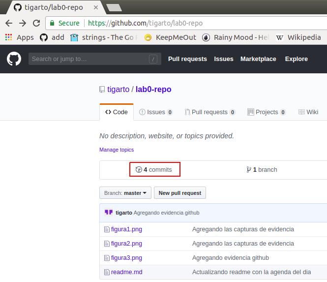
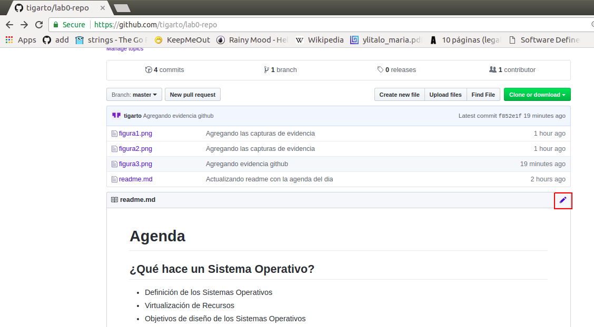
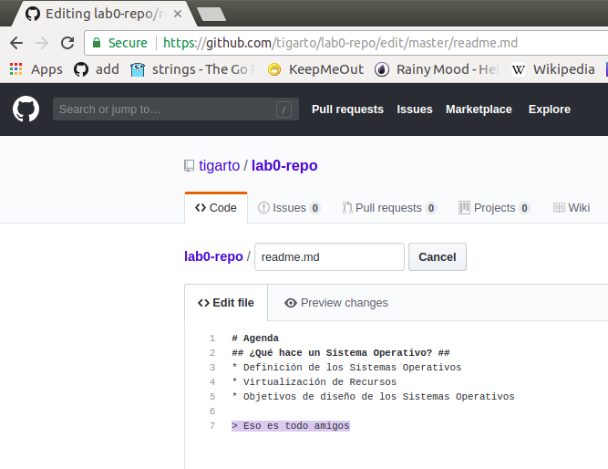
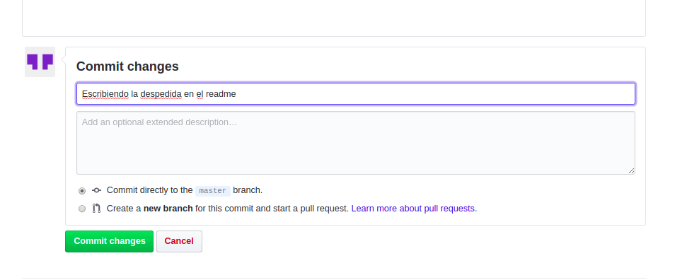

# Laboratorio git parte 1

El enlace: [git - la guía sencilla](http://rogerdudler.github.io/git-guide/index.es.html) tiene una breve descripción de los comandos que se emplearan a lo largo del presente laboratorio. Adicionalmente en el classroom del curso se pondran algunas refence sheet que le ayudarán a comprender mejor la potencia del git.

## Parte 1 ## 

Teniendo instalado git crear en la terminal un proyecto llamado **demo** reproduciendo los siguientes comandos:

```bash
git init demo (cd into it)
touch readme.md
git add readme.md
git reset readme.md
git add readme.md (to get it back in the staging area)
git commit -m 'creando un readme vacio'
```
Capture una imagen donde se evidencie lo que se hizo anteriormente llamandola figura1.png y guardela en demo.

## Parte 2 ##

Empleando el editor favorito copie y pegue el siguiente codigo dentro del readme:

```markdown
# Agenda
## ¿Qué hace un Sistema Operativo? ##
* Definición de los Sistemas Operativos
* Virtualización de Recursos
* Objetivos de diseño de los Sistemas Operativos
```

Guarde y ejecute los siguientes comandos:

```bash
clear
git status 
git diff
git add readme.md 
git status 
git commit -m 'Actualizando readme con la agenda del dia'
git status 
git log
```

Capture una imagen donde se evidencie lo que se hizo anteriormente llamandola figura2.png y guardela en demo.

```bash
clear
git status
git diff
git add *.png
git commit -m 'Agregando las capturas de evidencia'
git status
git log
```

## Parte 3 ##

Crear un nuevo repositorio en github tal y como se explica en el siguiente [enlace](https://help.github.com/en/articles/adding-an-existing-project-to-github-using-the-command-line) nombrelo como **lab0-repo**
dejando las demas opciones como aparecen por default El comando estrella aqui es **git remote add origin REPO_LOCATION**. Luego ejecute los siguientes comandos dentro del repo demo:


```bash
git remote add origin https://github.com/tigarto/lab0-repo.git 
git push -u origin master
```

Si se le pide origen y password coloquelos para que se actualice el repositorio. Luego en el navegador visualice el repositorio; si todo esta bien este se encontrará ya actualizado. Haga una captura de pantalla (llamela figura3.png) que evidencie el repositorio actualizado en el browser. Luego actualice el repositorio local empleando los siguientes comandos:

```bash
clear
git status
git add *.png
git status
git commit -m 'Agregando evidencia github'
git status
git log
```
Ahora, actulice el repositorio remoto:

```bash
git push -u origin master
```

## Punto 4 ##

Ahora, actualice el repositorio remoto en el browser, notará que ya se encuentra la captura figura3.png en el repositorio en github. Observe la parte relacionada con los commits dando click en la parte asiciada al cuadro rojo que se muestra en la siguiente figura:



Una vezde click alli podrá ver la historia de las modificaciones realizadas a lo largo de la evolución del proyecto. Digite en la consola el comando ```git log``` y comparelo con lo que aparece en el github: ¿Que puede deducir?


## Punto 5 ##

Antes de iniciar este punto observe los contenidos del archivo readme.md mediante el comando ```cat readme.md``` y notará que el contenido de este es similar al siguiente:

```bash
# Agenda
## ¿Qué hace un Sistema Operativo? ##
* Definición de los Sistemas Operativos
* Virtualización de Recursos
* Objetivos de diseño de los Sistemas Operativos
```

Vamos a proceder entonces a modificar en el github dicho archivo dando click en el botón de edición tal y como lo muestra la siguiente figura:




Agregue ahora en el **readme.md** la linea:

```
> Eso es todo amigos
```
Tal como se ve en la siguiente figura resaltada:



Escriba como mensaje en el commit: 

```
Escribiendo la despedida en el readme
```

La siguiente figura muestrá esto, una vez hecho presione el botón commit. 



Si vuelve a cargar el readme notara que este ha cambiado. Luego observe los commits del repositorio github y comparelos con los del repositorio local (```git log```). ¿Coinciden?

Ahora ejecute los siguientes comandos:

```
git pull
git log
cat readme.md
```

Si analiza todo usted podra notar que el readme ya se encuentra actualizado tanto local como remotamente.

## Enlaces de utilidad ##
1. [git - la guía sencilla](https://rogerdudler.github.io/git-guide/index.es.html)
2. [git book](https://git-scm.com/book/es/v2)
3. [Run a course with GitHub](https://happygitwithr.com/classroom-overview.html)
4. [Una referencia visual de Git](http://marklodato.github.io/visual-git-guide/index-es.html)
5. [Teacher training to master Git and GitHub](https://education.github.com/teachers/advisors)
6. [Learn Git with Bitbucket Cloud](https://www.atlassian.com/git/tutorials/learn-git-with-bitbucket-cloud)
7. [Git Cheatsheet - an interaction from NDP Software](http://ndpsoftware.com/git-cheatsheet.html#loc=;)


